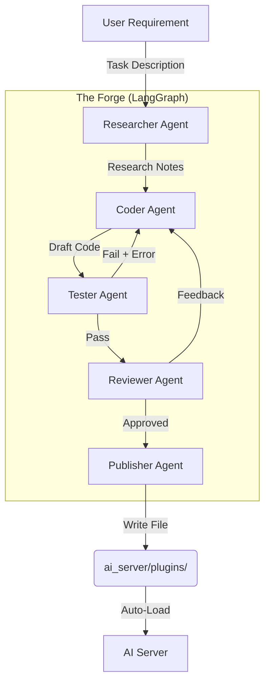
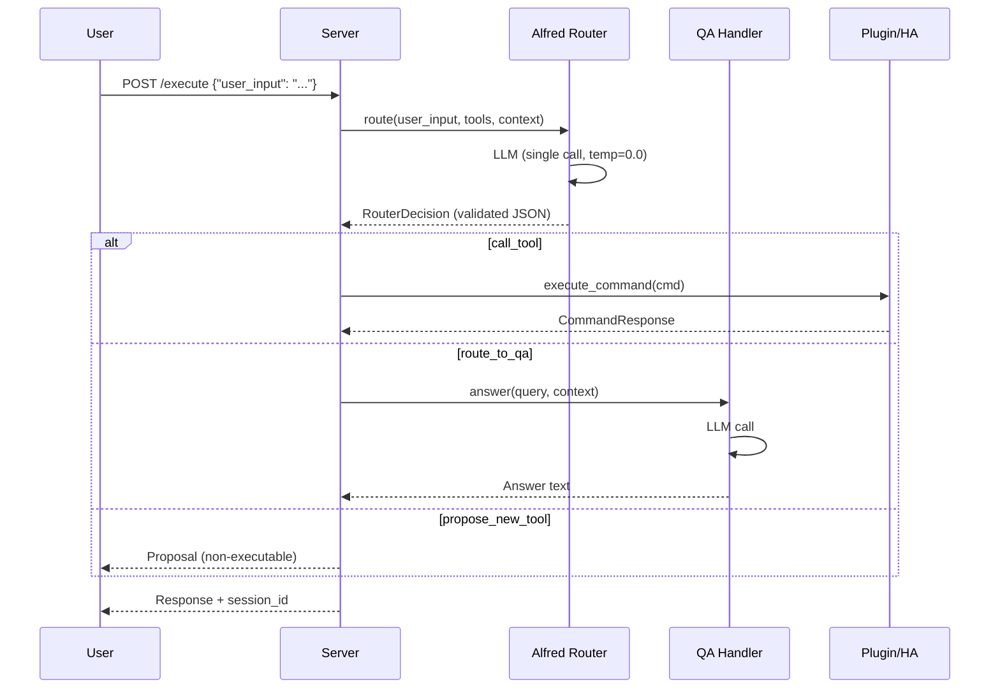

# System Architecture

## Overview

Alfred is a local-first smart home AI assistant built with FastAPI, Ollama (local LLMs), Faster Whisper (STT), and Piper TTS. It integrates with Home Assistant and is extensible via auto-loaded plugins. A multi-agent system ("The Forge") can generate new plugins on the fly.

## Core Components

### 1. AI Server (FastAPI)

The central nervous system. Exposes REST endpoints:

- `POST /execute` -- Main endpoint: takes natural language, routes via LLM, executes
- `POST /transcribe` -- Audio file to text (Faster Whisper)
- `POST /synthesize` -- Text to speech (Piper TTS)
- `GET /devices`, `GET /devices/{id}` -- Home Assistant device queries
- `GET/POST/DELETE /sessions` -- Conversation session management

### 2. Routing Backend (Feature Flag)

Controlled by `ALFRED_MODE` environment variable:

**AlfredCore** (`ALFRED_MODE=core`) -- Single LLM call that both decides and responds:
- Plain text output = conversational response (no second LLM call needed)
- JSON output = tool call (`call_tool`) or tool proposal (`propose_new_tool`)
- Malformed JSON = one retry with minimal fix-it prompt
- Replaces the two-call router + QA architecture

**Legacy Router + QA** (`ALFRED_MODE=router`, default) -- Two-step process:
- Alfred Router (Qwen 2.5 3B via Ollama) returns a `RouterDecision`
- Three decision types: `call_tool`, `route_to_qa`, `propose_new_tool`
- Q/A queries go to a separate QA handler (second LLM call)

### 3. Session Memory

SQLite-backed conversation history with context injection:
- Sessions auto-created or explicitly managed via `/sessions` endpoints
- Last 10 messages injected as context before each LLM call
- 30-minute idle timeout with automatic cleanup
- `ContextProvider` abstraction allows swapping history format (raw messages vs. summary)

### 4. Audio Pipeline

- **STT**: Faster Whisper (offline, CPU/GPU, VAD-enabled)
- **TTS**: Piper TTS (offline, CPU, ONNX voice models)
- `voice_mode` flag on `/execute` returns `audio_base64` alongside text response

### 5. The Forge (Experimental)

A LangGraph state machine that generates new plugins from natural language descriptions.



**Tester validation levels**: Syntax check, runtime/import check, instantiation check, interface compliance, behavioral verification (test scenarios).

Max 5 iterations to prevent infinite loops. Human approval required before invoking Forge.

### 6. Alfred Router Flow (Legacy Mode)



## Directory Structure

```
ai_server/
├── main.py                 # FastAPI app, endpoints, lifespan
├── config.py               # Pydantic settings (.env)
├── models.py               # Data models
├── intent_processor.py     # Optional NLP helper
├── core/                   # AlfredCore (unified brain)
├── alfred_router/          # Legacy router + QA handler
├── audio/                  # Whisper STT + Piper TTS
├── memory/                 # Session store + context provider
├── integration/            # Base class + Home Assistant
├── plugins/                # Auto-loaded plugins
└── forge/                  # Plugin generation (LangGraph)
```
