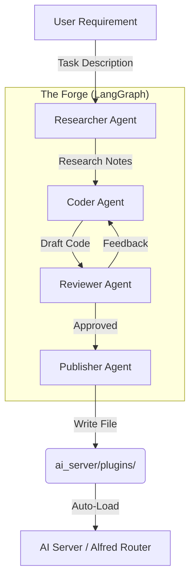
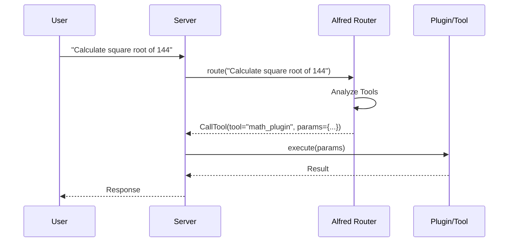

# System Architecture

## Overview
The "Home Ai" system is a local-first smart home assistant that integrates with Home Assistant and is extensible via plugins. It uses a multi-agent system ("The Forge") to generate new capabilities on the fly.

## Core Components

### 1. AI Server (FastAPI)
The central nervous system.
- **Main**: Exposes REST endpoints (`/execute`, `/transcribe`, `/devices`).
- **Integration Layer**: Connects to Home Assistant and loads generic Plugins.
- **Alfred Router**: A semantic router (using Qwen 2.5 3B via Ollama) that decides which tool to call based on user input.

### 2. The Forge (Agentic Loop)
A meta-agent system responsible for creating *new* capabilities (plugins).
Implemented as a `LangGraph` state machine.

### 3. Alfred Router Flow
How user commands are processed.

## Directory Structure
- `ai_server/`
  - `main.py`: Entry point.
  - `alfred_router/`: Semantic routing logic.
  - `forge/`: Agent definitions (Researcher, Coder, Reviewer).
  - `plugins/`: Directory where new skills are dropped.
  - `integration/`: Core Home Assistant logic.
